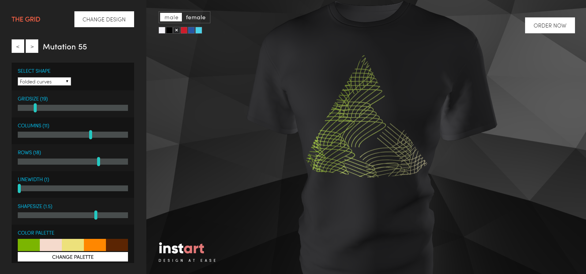

It started with a tech demo of projecting a 2D texture to a 3D surface. I initially just wanted to play around with Three.js when I stumbled upon a great demo, with which you could <a href="https://threejs.org/examples/?q=decal#webgl_decals"> shoot paint at Lee Perry Smith's head</a>. It's pretty fun, check it out. I'll post the various stages of the interface evolution later.

Simple designs, like lines and circles look great on t-shirts, but previewing them on a 2D stock photo doesn't really sell it how wrinkles alter the look of the design. That's why I started experimenting with 3D rendered images. I knew it can help great deal for people who can't visually predict how a certain design would look in real life.

At the time, I was already thinking about creating a generative art store, but the workflow of me just creating designs, uploading them to somewhere and marketing that store was rather off putting. Luckily I can prototype really fast and if I start from scratch then there is little limitation I have to work around. From time to time I invested time to evolve that demo to a working app. Today the app is still not released, but it's really close to the *private beta stage*.

### Design systems

Instart doesn't have fixed designs you can just buy. Instead I created design systems, algorithms that you can alter with many controls.

Think of the creation process as a way of co-creation. I provide the tools with the potential to produce great variety of artworks and you can be part of the design flow by finding unique settings which pleases you.

### What's coming on this blog?

I intend to share various types of content here, but just for the record:

- Announcements
- Design system showcases, what are some examples of certain settings
- Programming bits about solving an interesting problem
- Other random thoughts :)

I feel I've already written quite a lot for a hello world post, so it ends now here.
